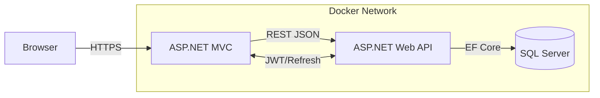

# Financial Tracker

**Full‑stack ASP.NET 8.0 MVC & Web API application for personal finance management, containerised with Docker Compose.**
---

## ✨ Key Features

| Layer | Highlights |
|-------|------------|
| **API (FinancialTracker.Server)** | • ASP.NET Core 8 Web API<br>• JWT + Refresh tokens & role‑based auth (Identity Core)<br>• Repository pattern with generic CRUD & AutoMapper<br>• MS SQL Server + EF Core code‑first migrations<br>• Swagger / OpenAPI 3.0 |
| **Client (FinancialTracker.Client)** | • ASP.NET Core MVC (Razor) UI<br>• Chart.js visualisation of income / expenses<br>• Typed HTTP clients with automatic token refresh<br>• Cookie auth & anti‑CSRF protection |
| **DevOps** | • Multi‑stage Dockerfiles (client & server)<br>• `docker‑compose` stack with SQL Server & health‑checks<br>• Self‑healing restart policies<br>• Ready for CI – `dotnet test`, publish & image push |

---

## 🏗 Architecture at a Glance



---

## 🚀 Quick Start

### 1. Prerequisites

* Docker Desktop ≥ 24.0 (or Docker Engine 20.10+)
* `git` CLI

### 2. Clone & Run

```bash
# Clone repository
$ git clone https://github.com/MarBog-tech/FinancialTracker.git
$ cd financial‑tracker

# Build & start all containers
$ docker compose up --build -d
```

The stack exposes:

| Service | URL |
|---------|-----|
| Client MVC | <http://localhost:8081> |
| Web API (Swagger UI) | <http://localhost:8080/swagger> |
| SQL Server | `localhost:1433` (user `SA`, pass `StrongPassword123!`) |

Containers will auto‑restart on failure. The database files persist in the `mssql_data` volume.

### 3. First Run & Migrations

The API automatically applies any pending EF Core migrations on startup (`ApplyMigration()` in *Program.cs*). To add new migrations:

```bash
# Inside the Web API container
$ docker compose exec webapi bash
/app$ dotnet ef migrations add <Name>
/app$ dotnet ef database update
```

---

## ⚙️ Configuration

All run‑time settings are provided via environment variables in **docker‑compose.yml**.

| Variable | Default | Description |
|----------|---------|-------------|
| `backend_url` (client) | `http://aspnetcore-webapi:8080` | Base URL the MVC app uses to call the API |
| `server` / `port` / `database` / `dbuser` / `password` | see compose file | SQL Server connection string parts |
| `ApiSettings:Secret` | configure in *appsettings.json* | Symmetric key for JWT signing |

For local debug without Docker, update *appsettings.Development.json* or export the variables before running `dotnet run`.

---

## 📂 Solution Structure

```
FinancialTracker.sln
├── FinancialTracker.Client    # ASP.NET MVC front‑end
│   ├── Controllers / Views / Services
│   └── Dockerfile
├── FinancialTracker.Server    # REST API & EF Core
│   ├── Controllers / Repository / Data / Models
│   └── Dockerfile
└── docker-compose.yml         # Full stack
